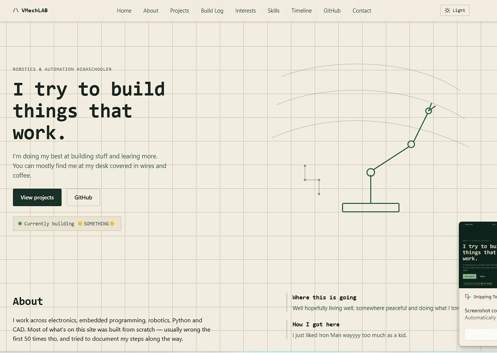
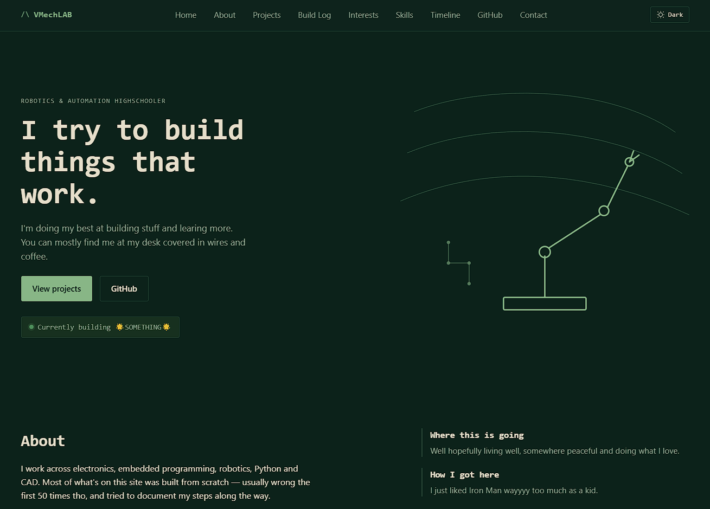

# VMechLAB
 
Personal engineering portfolio site for **ME** (VMech) — a place to showcase who I am, what I build, and the projects I've worked on. The site supports both dark and light themes and is built to show my work.
 
**Live site:** https://vmechlab.github.io/presonal-site/
 
---
 
## About
 
VMechLAB is my personal engineering site. It includes:
 
- A bio / about-me section,
- A showcase of projects and work samples,
- Light and dark theme support,
- A gallery of pictures related to my projects and background,
- I worked in embedded as an assistant and also "do" and "study" mechatronics,
- Took a liking to the Avionics and also I've got alot of intrests besides tech.
 
---
 
## Screenshots
 
| Light Mode | Dark Mode |
|---|---|
|  |  |

---
 
## Try It Out
 
You can view the live site here: **https://vmechlab.github.io/presonal-site/**
 
To run it locally:
 
```bash
# Clone the repository
git clone https://github.com/VMechLAB/presonal-site.git
cd presonal-site
```

Then open `http://localhost:3000` in your browser.
 
---
 
## Tech Stack
 
- **Frontend:** e.g. React / HTML, CSS, JavaScript
- **Hosting:** GitHub Pages

---

## 📄 License
 
- MIT - do whatever with it :)

## PS. if you are reading this love you ❤️
